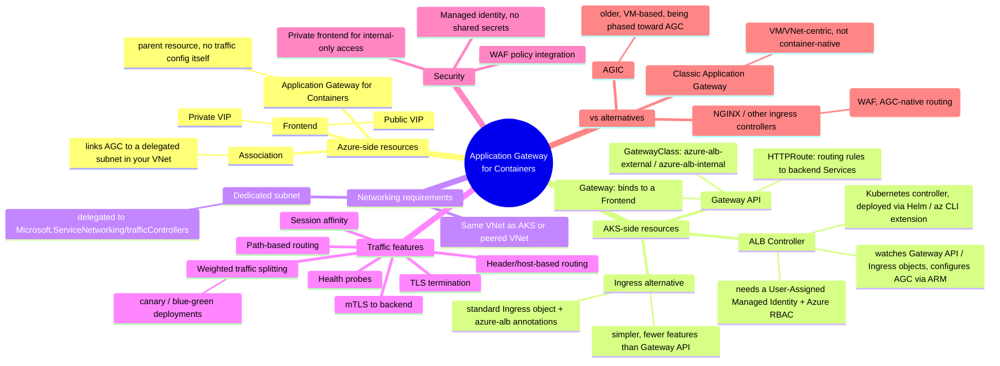

## https://www.youtube.com/watch?v=dgQQpJq1asc&list=PLzBajgDniE4k4ye-kqg3oT72rUrrj8lAG
## https://medium.com/@luca_4339/istio-azure-app-gateway-for-containers-9a025c6d71ff

flowchart LR
  U[User] --> Z[ZPA]
  Z --> D[Private DNS]
  D --> A[AGFC + WAF]
  A --> H[Gateway API HTTPRoute]
  H --> I[Istio ingressgateway Service]
  I --> G[Istio Gateway]
  G --> V[Istio VirtualService]
  V --> S[Service]
  S --> P[Pod / Istio sidecar]


##
# Azure Application Gateway for Containers (AGC)

L7 (application-layer) load balancer purpose-built for containerized workloads, primarily AKS. It's the successor to **AGIC** (Application Gateway Ingress Controller) — a separate product, not just a new version.

---

## Mind map



---

## Plain-text breakdown (if Mermaid doesn't render)

- **Application Gateway for Containers** (Azure resource)
  - **Frontend** — the entry point (public or private VIP)
  - **Association** — connects the AGC resource to a dedicated, delegated subnet in your VNet
- **ALB Controller** (runs inside AKS)
  - Installed via Helm chart / `az aks` extension
  - Uses a **user-assigned managed identity** with RBAC on the AGC resource
  - Watches Kubernetes **Gateway API** or **Ingress** objects and pushes config to Azure via ARM
- **Routing config** (defined in Kubernetes manifests)
  - `GatewayClass` → `azure-alb-external` (public) or `azure-alb-internal` (private)
  - `Gateway` → binds to one AGC **Frontend**
  - `HTTPRoute` → path/host rules pointing to backend **Services** (pods)
- **Traffic capabilities**: path/header routing, weighted traffic splitting, TLS termination, mTLS, session affinity, health probes
- **Security**: WAF policy attach, private-only frontends, managed identity (no secrets)

---

## 3 examples

### 1. Simple public HTTP app (Gateway API)
```yaml
apiVersion: gateway.networking.k8s.io/v1
kind: Gateway
metadata:
  name: my-gateway
spec:
  gatewayClassName: azure-alb-external
  listeners:
    - name: http
      port: 80
      protocol: HTTP
---
apiVersion: gateway.networking.k8s.io/v1
kind: HTTPRoute
metadata:
  name: my-app-route
spec:
  parentRefs:
    - name: my-gateway
  rules:
    - backendRefs:
        - name: my-app-service
          port: 8080
```
Public internet → AGC public Frontend → ALB Controller-configured route → `my-app-service` pods.

### 2. Canary / weighted traffic split (blue-green)
```yaml
apiVersion: gateway.networking.k8s.io/v1
kind: HTTPRoute
metadata:
  name: canary-route
spec:
  parentRefs:
    - name: my-gateway
  rules:
    - backendRefs:
        - name: app-v1-service
          port: 8080
          weight: 90
        - name: app-v2-service
          port: 8080
          weight: 10
```
90% of traffic → stable `v1`, 10% → new `v2` for gradual rollout — no separate deployment tooling needed, AGC handles the split.

### 3. Private internal frontend with TLS termination
```yaml
apiVersion: gateway.networking.k8s.io/v1
kind: Gateway
metadata:
  name: internal-gateway
spec:
  gatewayClassName: azure-alb-internal
  listeners:
    - name: https
      port: 443
      protocol: HTTPS
      tls:
        mode: Terminate
        certificateRefs:
          - name: my-tls-secret
```
Only reachable from within the VNet (or peered/connected networks) — TLS is terminated at AGC, backend traffic runs plain HTTP (or mTLS if configured) to the pods.

---

## Quick comparison

| | AGIC | Application Gateway for Containers | Classic App Gateway |
|---|---|---|---|
| Target | AKS (via annotations on classic App Gateway) | AKS / containers (Gateway API native) | VMs, VMSS, IPs |
| Config model | Ingress + annotations | Gateway API (preferred) or Ingress | Portal/ARM rules |
| Traffic splitting | Limited | Native, weighted | Limited |
| Status | Being superseded | Current recommended path for AKS | Still used for non-container workloads |

---

## kubectl cheat sheet for AGC

### 1. ALB Controller health (runs in AKS, deployed via Helm)
```bash
# Check the controller pods (usually in 'azure-alb-system' namespace)
kubectl get pods -n azure-alb-system

# Check controller deployment status
kubectl get deployment -n azure-alb-system

# Tail controller logs (main place to debug reconciliation issues)
kubectl logs -n azure-alb-system deploy/alb-controller -f

# Describe a controller pod if it's crashlooping
kubectl describe pod -n azure-alb-system <pod-name>

# Check the Helm release itself
helm list -n azure-alb-system
helm status alb-controller -n azure-alb-system
```

### 2. ApplicationLoadBalancer (the CRD tying Kubernetes to your Azure AGC + Association)
```bash
# List ALB custom resources across namespaces
kubectl get applicationloadbalancer -A

# Describe one to check status/conditions (e.g. subnet association issues)
kubectl describe applicationloadbalancer <alb-name> -n <namespace>
```

### 3. Gateway API core objects
```bash
# Confirm Gateway API CRDs are installed
kubectl get crds | grep gateway.networking.k8s.io

# List GatewayClasses (should show azure-alb-external / azure-alb-internal)
kubectl get gatewayclass

# List Gateways and their addresses (VIP shows up here once provisioned)
kubectl get gateway -A -o wide

# Describe a Gateway — check Programmed/Accepted conditions and listener status
kubectl describe gateway <gateway-name> -n <namespace>

# List HTTPRoutes
kubectl get httproute -A

# Describe an HTTPRoute — check "Accepted" and "ResolvedRefs" conditions
kubectl describe httproute <route-name> -n <namespace>
```

### 4. AGC policy CRDs (attached to Gateways/HTTPRoutes)
```bash
# Health probe customization
kubectl get healthcheckpolicy -A
kubectl describe healthcheckpolicy <name> -n <namespace>

# WAF policy attachment
kubectl get webapplicationfirewallpolicy -A

# Backend mTLS (Gateway API experimental CRD)
kubectl get backendtlspolicy -A
```

### 5. Backend services and endpoints (what HTTPRoute actually forwards to)
```bash
# Confirm the backend Service exists and has the right port
kubectl get svc -n <namespace>

# Confirm endpoints are populated (empty endpoints = 502s from AGC)
kubectl get endpoints <service-name> -n <namespace>

# Check pod readiness backing the service
kubectl get pods -n <namespace> -l <selector-from-service>
```

### 6. General troubleshooting
```bash
# Events often show ALB Controller reconciliation errors
kubectl get events -n <namespace> --sort-by='.lastTimestamp'

# Full YAML dump for a Gateway/HTTPRoute (spot annotation/status mismatches)
kubectl get gateway <name> -n <namespace> -o yaml
kubectl get httproute <name> -n <namespace> -o yaml

# Check the managed identity / RBAC secret mounted for the controller
kubectl get sa -n azure-alb-system
kubectl describe sa <alb-controller-sa> -n azure-alb-system
```

> Note: exact CRD group/version names (`alb.networking.azure.io/...`) can shift as AGC moves through preview/GA updates — run `kubectl get crds | grep alb` on your cluster to see what's actually installed before relying on a specific API version.
